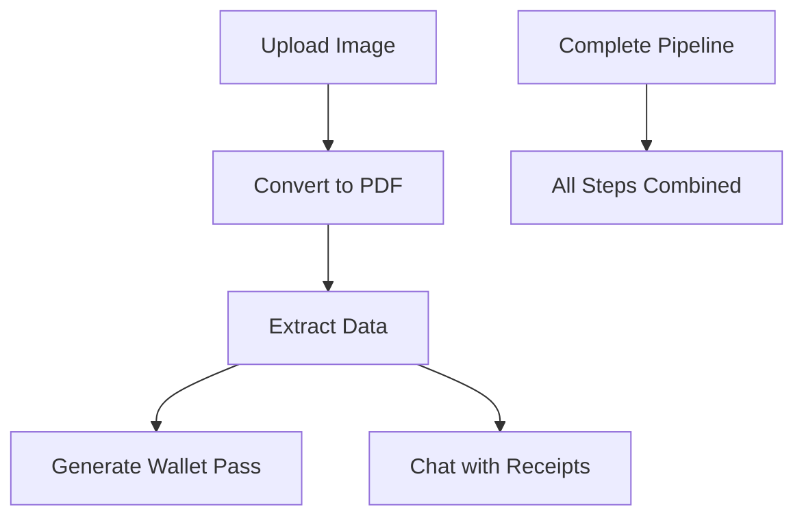

# 📄 Receipt Processing Pipeline API

A powerful FastAPI-based Receipt Processing Pipeline that provides a complete workflow for transforming receipt images into structured data and Google Wallet passes, with AI-powered chat capabilities.

## ✨ Features

- 📸 **Image Upload** - Support for multiple image formats
- 📄 **PDF Conversion** - Automatic image to PDF conversion
- 🤖 **AI Data Extraction** - Extract structured data using AI
- 📱 **Google Wallet Pass** - Generate digital wallet passes
- 💬 **Gemini-Powered Chatbot** - Natural language queries about your receipts

## 🚀 Getting Started

### Prerequisites

- Python 3.8+
- Google Cloud credentials (for AI features)

### Installation

Install the required dependencies:

```bash
pip install fastapi uvicorn aiofiles google-cloud-aiplatform vertexai
```

### Project Structure

```
your_project/
├── pipeline_api.py             # Main API
├── gemini_chatbot.py           # Chatbot backend
├── imageconvert.py             # Converts image to PDF
├── dataextract.py              # Extracts receipt data from PDF
├── pass_generation.py          # Generates Wallet pass
├── pipeline_receipt.json       # Stored receipt data
├── temp_receipt.json           # Latest receipt data
└── splendid-yeti-...json       # Google Service Account credentials
```

### Running the API

Start the server:

```bash
python3 pipeline_api.py --host 0.0.0.0 --port 8001 --reload
```

The API will be available at: `http://localhost:8001`

> **Note:**
> - The `pipeline_api.py` script now supports `--host` and `--port` arguments. Always run it on port **8001** to avoid conflicts with the chatbot service.
> - The `new_chatbot.py` service should run on port **8000**.

## 📚 API Documentation

### 🏠 Basic Endpoints

#### Root
```http
GET /
```
Returns basic API info and available endpoints.

#### Health Check
```http
GET /health
```
Check if the server is running.

**Response:**
```json
{
  "status": "healthy",
  "timestamp": "2025-07-07T10:30:00Z"
}
```

### 📦 Receipt Processing Pipeline

#### 📸 Upload Image
```http
POST /upload
```

Upload an image file to convert it to PDF.

**Supported formats:** `.jpg`, `.jpeg`, `.png`, `.bmp`, `.tiff`

**Request:**
- `file`: Image file (multipart/form-data)
- `debug`: Enable debug mode (optional, boolean)

**Response:**
```json
{
  "success": true,
  "message": "Image uploaded and converted to PDF successfully",
  "input_file": "uploaded_image_20250707_103000.jpg",
  "output_pdf": "receipt_20250707_103000.pdf",
  "file_size": 102400,
  "timestamp": "2025-07-07T10:30:00Z"
}
```

#### 🔍 Extract Data
```http
POST /extract
```

Extract structured receipt data from the PDF.

> **Note:** If you don't specify a PDF, it uses the latest uploaded one.

**Response:**
```json
{
  "success": true,
  "message": "Data extracted successfully",
  "pdf_file": "receipt_20250707_103000.pdf",
  "receipt_data": { ... },
  "timestamp": "2025-07-07T10:31:00Z"
}
```

#### 📱 Generate Wallet Pass
```http
POST /passgen
```

Generate a Google Wallet Pass link from the extracted receipt data.

**Response:**
```json
{
  "success": true,
  "message": "Google Wallet pass generated successfully",
  "wallet_link": "https://pay.google.com/gp/v/save/abc123",
  "timestamp": "2025-07-07T10:32:00Z"
}
```

#### ⚡ Complete Pipeline
```http
POST /process-complete
```

Run the full pipeline in one call: upload → extract → pass.

**Request:** Same file upload as `/upload`

**Response:**
```json
{
  "success": true,
  "message": "Complete processing pipeline executed successfully",
  "wallet_link": "https://pay.google.com/gp/v/save/abc123",
  "timestamp": "2025-07-07T10:33:00Z",
  "steps": {
    "upload": {...},
    "extract": {...},
    "passgen": {...}
  }
}
```

#### 📊 Status & History

##### Get Status
```http
GET /status
```
Check current processing state.

##### Get History
```http
GET /history
```
Get history of all processing steps performed so far.

##### Download File
```http
GET /download/{filename}
```
Download any generated file (e.g., PDF or JSON).

### 💬 Gemini-Powered Chatbot

**Base URL:** `http://localhost:8000/chatbot`

#### 🤖 Chat
```http
POST /chatbot/chat
```

Ask a question about your receipts using natural language.

**Request:**
```json
{
  "query": "How much did I spend on groceries?"
}
```

**Response:**
```json
{
  "response": "Groceries: ₹1200.0 | Food: ₹800.0",
  "categories_analyzed": ["Groceries", "Food"],
  "receipts_count": 12,
  "timestamp": "2025-07-07T10:35:00Z"
}
```

#### 🔄 Reload Receipts
```http
POST /chatbot/reload
```
Reload `pipeline_receipt.json` into memory.

#### 📂 Get Categories
```http
GET /chatbot/categories
```
List all supported expense categories.

#### 📈 Get Receipts Count
```http
GET /chatbot/receipts/count
```
Get current number of loaded receipts.

#### 💚 Chatbot Health
```http
GET /chatbot/health
```
Check if the chatbot backend is healthy.

## 💡 Usage Tips

1. **Sequential Processing:** Always call `/upload` before `/extract`, and `/extract` before `/passgen`
2. **One-Step Processing:** Use `/process-complete` to run all three steps in one call
3. **Chatbot Setup:** Ensure your `pipeline_receipt.json` has data before using chatbot features
4. **File Management:** Use `/download/{filename}` to retrieve generated files

## 🛠️ API Workflow



## 📝 Example Usage

### Upload and Process a Receipt
```bash
# Upload image
curl -X POST "http://localhost:8000/upload" \
  -F "file=@receipt.jpg"

# Extract data
curl -X POST "http://localhost:8000/extract"

# Generate wallet pass
curl -X POST "http://localhost:8000/passgen"

# Or do all at once
curl -X POST "http://localhost:8000/process-complete" \
  -F "file=@receipt.jpg"
```

### Chat with Your Receipts
```bash
curl -X POST "http://localhost:8000/chatbot/chat" \
  -H "Content-Type: application/json" \
  -d '{"query": "What did I spend on restaurants last month?"}'
```

## 📄 License

This project is licensed under the MIT License.

## 🤝 Contributing

Contributions are welcome! Please feel free to submit a Pull Request.

## 📞 Support

For issues and questions, please open an issue in the GitHub repositor